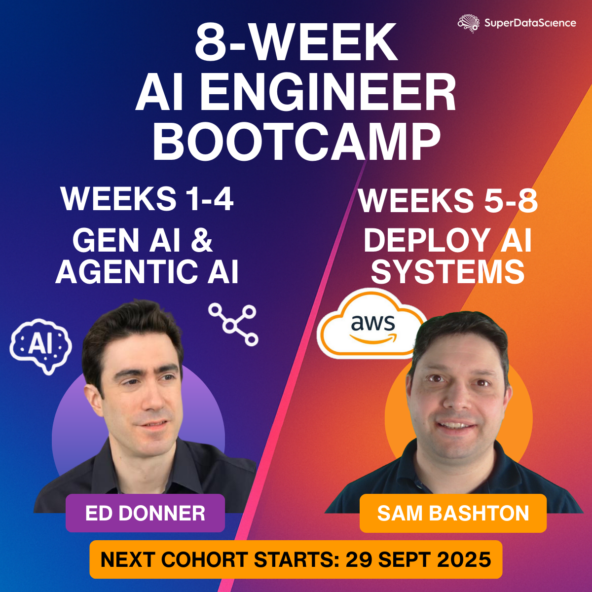

# SuperDataScience AI Bootcamp

## 8 week intensive bootcamp on AI Engineering, Agentic AI, and Building & Deploying Production AI Systems

_If you're looking at this in Cursor, please right click on the filename in the Explorer on the left, and select "Open preview", to view the formatted version._

This repo is for the first 4 weeks where we immerse ourselves in LLMs and Agents, before you move to building and deploying AI systems for Production.

Please reach out to me on Slack at any time if I can help.

But first - the setup instructions.

- Windows people, your instructions are [here](setup/SETUP-PC.md)
- Mac people, yours are [here](setup/SETUP-mac.md)
- Linux people, yours are [here](setup/SETUP-linux.md)

Any problems, please do contact me.

### Super useful resources

- Many essential guides in the [guides](guides/01_intro.ipynb) section
- The [troubleshooting](setup/troubleshooting.ipynb) notebook

Be sure to monitor your API costs to ensure you are totally happy with any spend. For OpenAI, the dashboard is [here](https://platform.openai.com/usage).